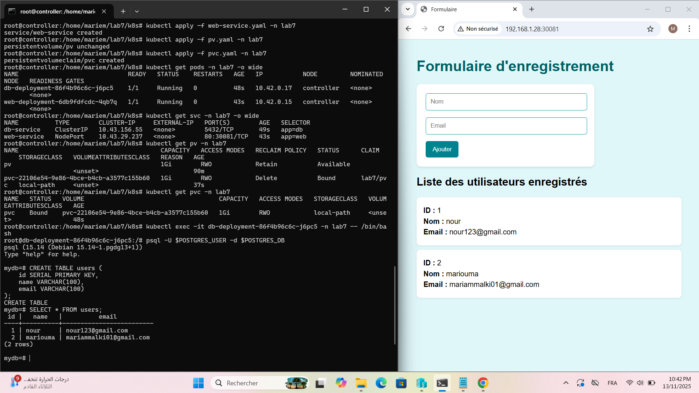
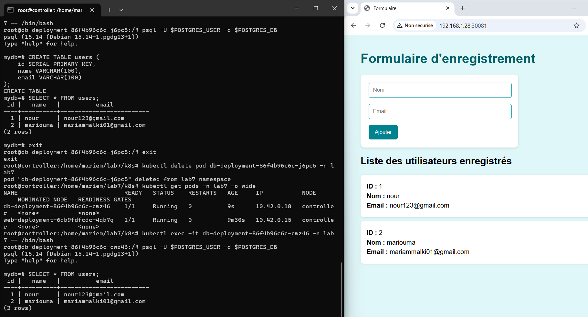

Lab 7 — Persistance des données avec PV & PVC (Flask + PostgreSQL sur K3s)

 1. Objectif du projet

Ce laboratoire étend le Lab 6 en ajoutant des Persistent Volumes (PV) et Persistent Volume Claims (PVC) afin d’assurer la persistance des données de la base de données PostgreSQL.

L’objectif est de conserver les données même si le pod de la base est supprimé ou redémarré.

Composants :

Frontend : Application web Flask (exposée via NodePort)

Backend : Base de données PostgreSQL (ClusterIP)

Persistance : PV & PVC utilisés par PostgreSQL

 2. Architecture
🔹 Description

L’architecture se compose des éléments suivants :

Composant	Description
web-deployment	Déploiement de l’application Flask
web-service	Service NodePort pour accès externe
db-deployment	Déploiement de la base PostgreSQL
db-service	Service ClusterIP pour communication interne
PersistentVolume (PV)	Espace de stockage physique sur le nœud
PersistentVolumeClaim (PVC)	Requête de stockage utilisée par PostgreSQL

📁 3. Structure du projet
lab7/
├── app/
│   ├── app.py
│   ├── templates/
│   └── requirements.txt
├── k8s/
|   |__ namespace.yaml
│   ├── configmap.yaml
│   ├── secret.yaml
│   ├── pv.yaml
│   ├── pvc.yaml
│   ├── db-deployment.yaml
│   ├── db-service.yaml
│   ├── web-deployment.yaml
│   └── web-service.yaml
│__docs
└── README.md

⚙️ 4. Étapes de déploiement
 Étape 1 — Créer le ConfigMap et le Secret
kubectl apply -f configmap.yaml
kubectl apply -f secret.yaml

Étape 2 — Créer le PV et le PVC
kubectl apply -f pv.yaml
kubectl apply -f pvc.yaml

Vérifier la création :

kubectl get pv
kubectl get pvc

 Étape 3 — Déployer la base de données PostgreSQL
kubectl apply -f db-deployment.yaml
kubectl apply -f db-service.yaml

 Étape 4 — Déployer l’application Flask
kubectl apply -f web-deployment.yaml
kubectl apply -f web-service.yaml

🔍 5. Vérifications
Voir les pods et services :
kubectl get pods
kubectl get svc

Vérifier la persistance :
kubectl get pv,pvc

🌍 6. Accès à l’application

Récupérer l’adresse IP du nœud :

kubectl get nodes -o wide

Ouvrir le navigateur sur :

http://<NODE_IP>:30081

Le port 30081 correspond au port NodePort du service Flask.

7. Test de persistance des données

Ouvre la page web du formulaire.

Saisis un nom et un email, puis clique sur Ajouter.

Vérifie que les données s’affichent dans la liste.

Supprime le pod de la base de données :

kubectl delete pod -l app=db

Une fois le pod redémarré, actualise la page web —
✅ Les données sont toujours présentes → la persistance fonctionne.

🔐 8. Configuration et sécurité

Les variables de configuration (DB_HOST, DB_NAME, etc.) sont stockées dans le ConfigMap.

Les identifiants sensibles (DB_USER, DB_PASSWORD) sont gérés via un Secret.

Le PVC assure que les données PostgreSQL sont stockées de manière persistante sur le disque du nœud.

✅ 9. Résultat attendu

L’application Flask et la base PostgreSQL fonctionnent correctement sur le cluster K3s.

Les données restent disponibles après le redémarrage du pod PostgreSQL.

La configuration et les secrets sont gérés proprement via ConfigMap et Secret.

La persistance est assurée par le couple PV/PVC.
